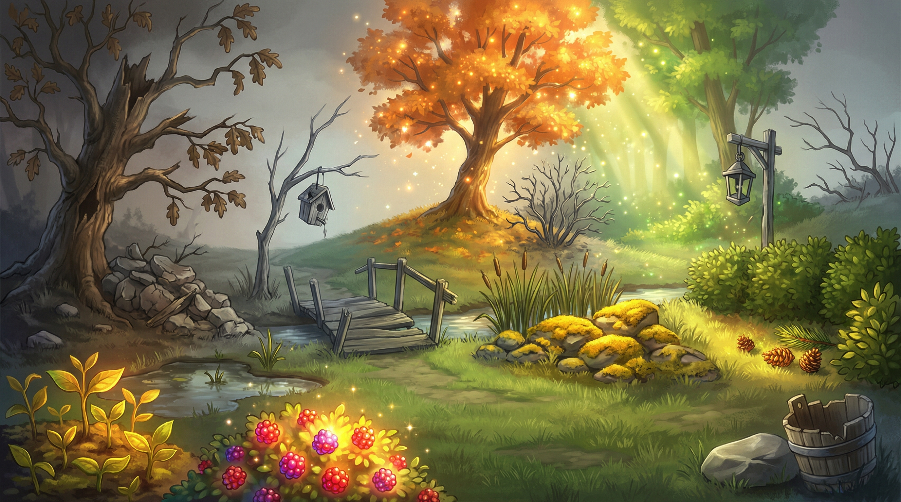

# BananaVerse

  

  

## Instalation
Make sure you have the following installed on your system:
- **Node.js**
- **npm**
- **Python**
- **pip**
- **virtualenv** (optional but recommended)

## Installation & Setup

### 1. Clone the Repository

### 2. Front end
Front end is located in /frontend/Survey-Monkey-Upgrade

### 3. Step
npm install  
npm run dev

### 4. Backend
Located in /backend

### 5. Create a virual environment

### 6. Run pip install -r requirements.txt

### 7. Add GEMINI_API_KEY in .env

### 8. Start the backend => uvicorn server:app --reload

## Inspiration

The world needs feedback, organic experience, but mining that information is no easy banana to peel when our universe makes feedback so boring. The inspiration for BananaVerse was simple: feedback shouldn't feel like a chore. Existing surveys interrupt people and demand effort for little to no reward. BananaVerse flips the script so that instead of rating an experience, users build one. An experience that is creative, visual, shareable and most importantly feels like creation rather than extraction.

## What it does

* Survey Creation:
    * BananaVerse let's a business create engaging and interactive surveys quickly and with ease.
    * The Business can: 
        * add questions,
        * use premade elements
        * generate their own unique elements
* Interactive Survey Response:
    * By responding to the survey, the user sees their landscape come to life. Each response contributes to the users landscape.
    

* Image Generation
    * Upon completion, the user is then able to download their unique landscape generated by Gemini's Nano Banana Gen AI model.

## How we built it

* Tech Stack:
    * Backend: Python, Gemini API
    * Frontend: NodeJS, React, CSS
    * Version Control: Git, GitHub

- Implementation: 
The project was implemented as a web-based application, with a component-driven architecture to manage user input, dynamic content, and interface state.

## Challenges we ran into
1. Balance between innovation and practicality: 
Desiging a survey application that was innovative and creative without losing sight of the practical needs of businesses.

2. Prompt Engineering: 
Designing the prompts to ensure that the Gemini API would generate the images we wanted while keeping contrast within the elements.

    

## Accomplishments that we're proud of

1. Redefined Survey Interaction: 
Designed a survey experience driven entirely by visual choices rather than text or numeric imputation turning feedback into a gameified process.

2. Sleek, Minimal UI: 
Built a minimal and responsive user interface.

## What we learned
1. Teamwork: We learned to work well as a team and solve a unique problem together.
2. Prompt Engineering
3. Image Generation
4. Responsive Web Design

## What's next for BananaVerse
Behind the scenes, AI-driven analysis and agentic workflows combine image choices with user information to uncover sentiment and experience insights for your business.
